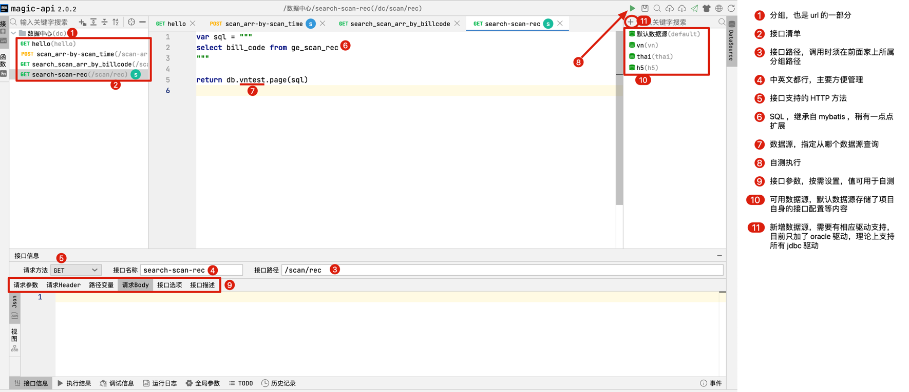

# User center-API 用户中心 API 服务

1. 配置多数据源
   a. 通过在 application*.yml 中添加，如

   ```yaml
      data:
       datasource:
           vntest: # 数据源名称，在接口编写是通过 db.vntest 形式引用此数据源
               driver-class-name: # 驱动名
               url: #数据库地址
               username: # 数据库用户名
               password: # 数据库密码
   ```

   b. 通过 web 界面添加

2. 文档 https://www.ssssssss.org/magic-api/

3. 例子 https://magic-api.ssssssss.org.cn/magic/web/index.html

4. [数据库存储接口配置相关建表 sql](docs/magic-api-database-init.sql)

5. 本地 API 文档 http://127.0.0.1:9999/swagger-ui.html#/

## 开发界面说明

